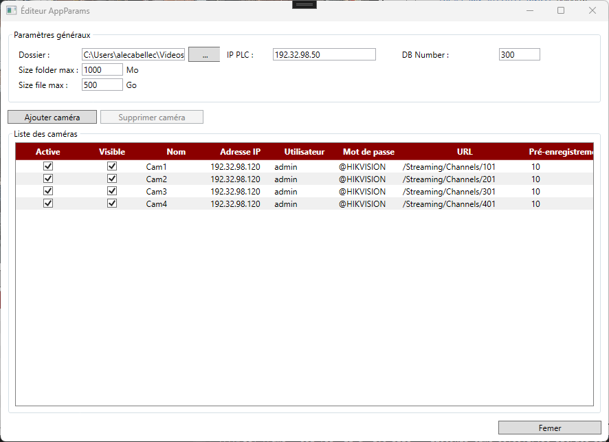

# CameraRecoder

<!-- LOGO -->
<!--

  

-->

## 1 - TELECHARGER

CameraRecorder est une application Windows qui permet de visualiser et d'enregistrer le flux video de camera en RTSP. Le déclenchement de l'enregistrement peut être réalisé localement ou depuis un automate Siemens

<!--Télécharger l'installateur➡️ [Setup](https://github.com/tonycab/IPTraySwitcher/releases/download/V0.0.1/IPTraySwitcher_Installer.exe)-->

## 2 - COMMENCER

Page principale

<!-- Tray -->

  

## 3 - PARAMETRAGE

<!-- Menu -->

  

## 4 - AMELIORATION A FAIRE

- [ ] Gérer d'autres protocols industriels

(<a href="#readme-top">Back to top</a>)

